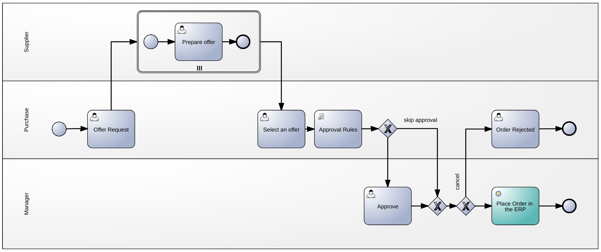
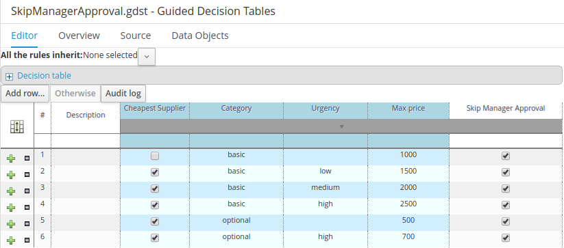

Order Management Demo
=======================


Introduction
-----------------------

This demo aims to show some of the core capabilities of [Red Hat JBoss BPM Suite v6.4](https://www.redhat.com/en/technologies/jboss-middleware/bpm):

- A Human Intensive process not too complex to be quickly understood with some interesting details that are common requirements in the process modelling.
- A Decision Table that specify when to require the manager approval

In this [video recording](https://youtu.be/pSCEHUhI5oQ) you can find a round trip of the demo.

Use case scenario
-----------------------

The Order Management process is a classical provisioning flow that any kind of organization has in place.

The purchase department receives a purchase request (process start), a purchase specialist will see in his / her task list the **Offer Request** task. To complete the task, he/she has to specify the item category and which supplier to involve in the request for proposal (in demo there are three options: supplier1, supplier2, supplier3). 

All the involved suppliers respond with their best offer. This is implemented by the **Prepare Offer** task where the supplier can input the price and the delivery date. This task is wrapped by a parallel sub process, this means that potentially there are many parallel instances of it; actually, the number of parallel instances depends on the supplier list created by the purchase department in the previous task. 

The **same** purchase specialist, that submitted the request, receives back the suppliers responses and has to analyse and select the best offer (Select Offer Task).

A set of rules define if it's necessary the manager approval, otherwise the order is directly submitted to the ERP system. In case of engagement, the manager can see the order details, approve or reject with a reason.
Whether the order is rejected, the purchase specialist get a new task that inform about the reason of the denial.

BPMN Design
-----------------------



Decision Table
-----------------------


Users & Roles
-----------------------

In the process, there are 4 roles:

- The process starter who issues the purchase request (any in the **user** group)
- The purchase department employee (any user in the **developer** group)
- The manager of the purchase department (any user in the **manager** group)
- The suppliers that answer to the order offer request (3 named users in the **supplier** group)

The suppliers users must match the following user names:

- supplier1
- supplier2
- supplier3

Installation
-----------------------

Enable multiple incoming flow sequences for activities:

- Add this system property to the standalone.xml: `jbpm.enable.multi.con=true`

Considering a standard installation where the group are mapped in the JEE roles, you can add users through JBoss EAP command line:

	./add-user.sh -a -u supplier1 -p password --role user,supplier
	./add-user.sh -a -u supplier2 -p password --role user,supplier
	./add-user.sh -a -u supplier3 -p password --role user,supplier

In order to deploy the rules independently from the process, in this demo you have to place the data model in the *BPM runtime class path*:

```
cd OrderModel/
mvn clean package
cp target/OrderModel-2.0-SNAPSHOT.jar <JBOSS-EAP-HOME>/standalone/deployments/business-central.war/WEB-INF/lib/
```

In Business Central:

- Clone this repository
- Build and deploy `OrderRules`
- Build and deploy `OrderProc`

The last task of the process involves an external REST Service (Place the order in ERP System): it sends an *HTTP GET request* at this URL: `http://localhost:8090/test`.

To emulate the REST Service, you can run [SOAP UI](https://www.soapui.org/) and here you can find a project ready to be imported in SOAP UI:

- [SOAP UI Project with the mock service](install/REST-Project-1-soapui-project.xml).
- To start the service: double click on **REST MockService 1** to open the mock window in SOAP UI and click on the start icon (green arrow).


TODO
-----------------------

- Create an automated procedure to install the product and the demo from scratch.
- Integrate with the [entando](http://www.entando.com/) front-end
- Script to automatically execute processes and populate the DB


